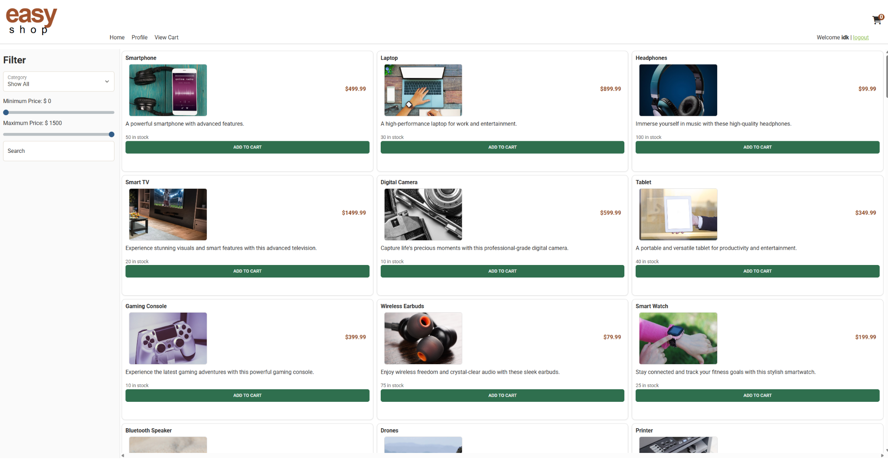
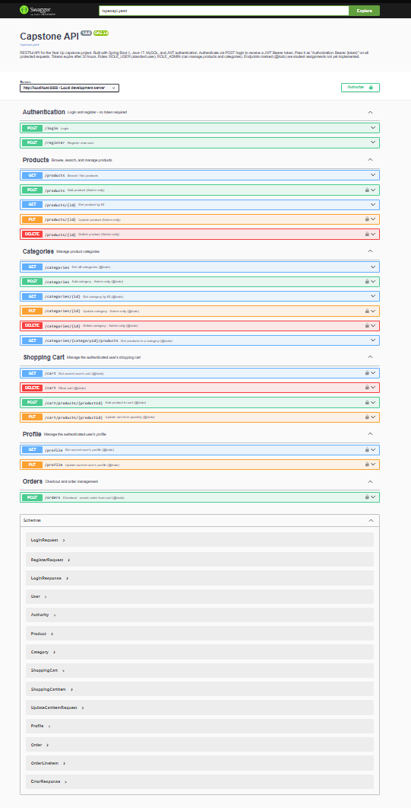
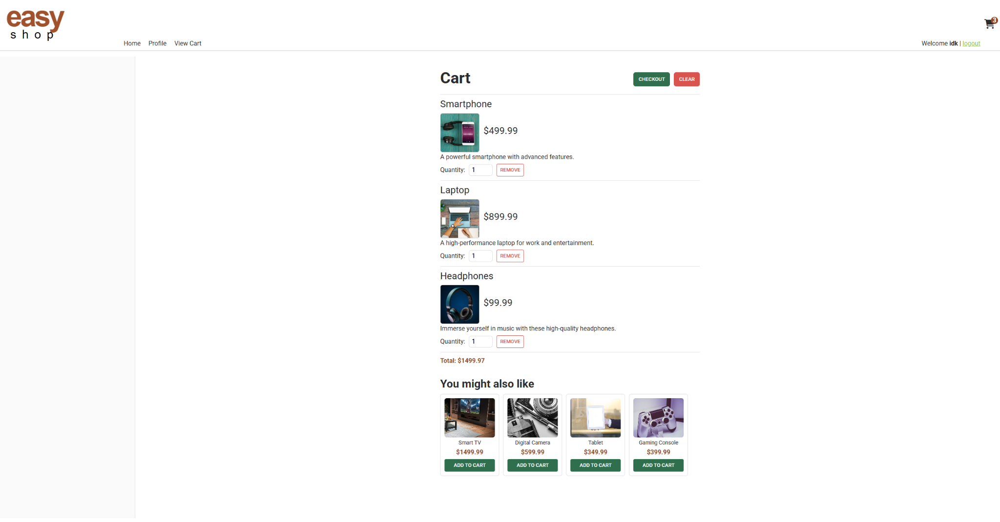
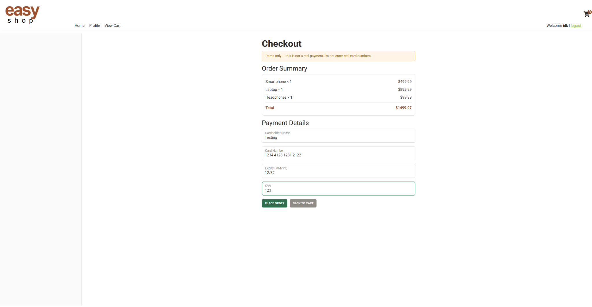
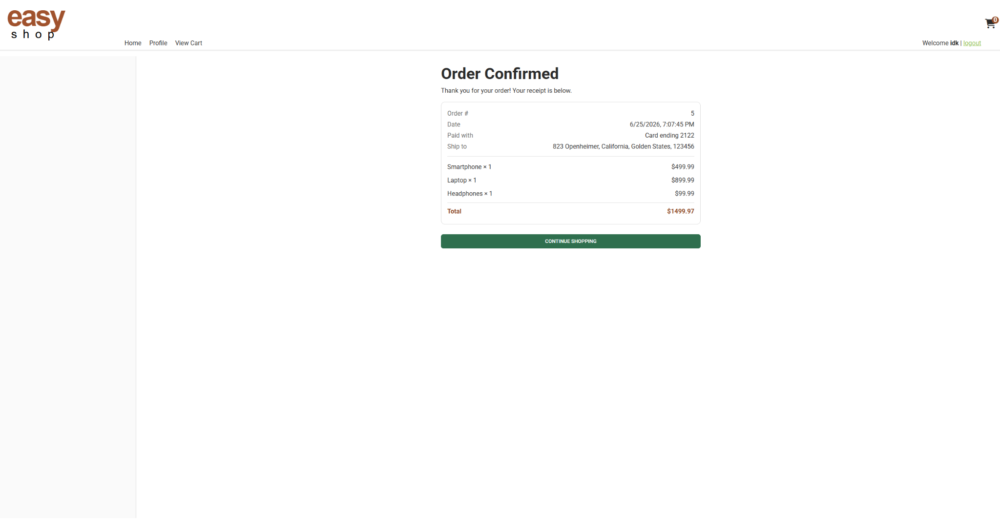
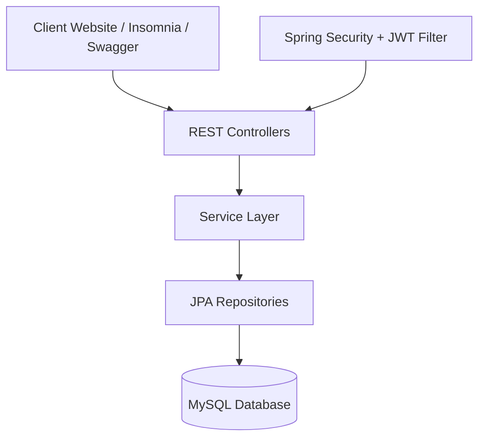
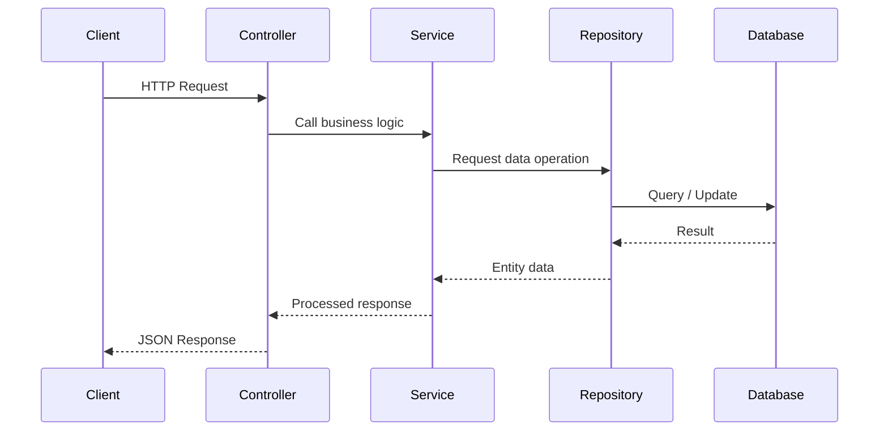

<div align="center">

# 🛒 EasyShop API

### Secure Spring Boot E-Commerce REST API

A complete backend for an online shopping platform featuring JWT authentication, role-based authorization, product and category management, shopping carts, user profiles, and checkout/order processing.

<br>


<br>

**Spring Boot • Spring Security • JWT • MySQL • JPA • REST API**

</div>

---

## Table of Contents

* [Overview](#overview)
* [Application Preview](#application-preview)
* [Project Highlights](#project-highlights)
* [Tech Stack](#tech-stack)
* [Architecture](#architecture)
* [API Reference](#api-reference)
* [Authentication](#authentication)
* [Getting Started](#getting-started)
* [Testing](#testing)
* [Design Notes](#design-notes)
* [Future Enhancements](#future-enhancements)
* [Author](#author)

---

## Overview

EasyShop API is the backend for an e-commerce web application. It provides secure authentication, public product browsing, admin-protected product and category management, persistent shopping carts, profile management, and checkout functionality.

The project follows a layered Spring Boot architecture:

* **Controllers** handle HTTP requests and responses.
* **Services** contain business logic.
* **Repositories** communicate with the database using Spring Data JPA.
* **Models** represent database entities and API response objects.
* **Security** protects routes using JWT authentication and role-based authorization.

---

## Application Preview

### Home Page

<p align="center">
  
</p>

Browse products, filter inventory, search items, and add products directly to the shopping cart.

---

### Swagger API Documentation

<p align="center">
  
</p>

Interactive API documentation for exploring and testing available endpoints.

---

### Shopping Cart

<p align="center">
  
</p>

View cart items, update quantities, review totals, and proceed to checkout.

---

### Checkout

<p align="center">
  
</p>

Review order details and complete the checkout process.

---

### Order Confirmation

<p align="center">
  
</p>

Display a receipt after successfully placing an order.

---

## Project Highlights

| Feature                  | Description                                                                |
| ------------------------ | -------------------------------------------------------------------------- |
| Authentication           | Users can register, log in, and access protected routes using JWT tokens.  |
| Role-Based Authorization | Admin-only actions are restricted using Spring Security.                   |
| Product Search           | Products can be filtered by category, price range, and subcategory.        |
| Shopping Cart            | Logged-in users can add products, update quantities, and clear their cart. |
| User Profile             | Users can view and update their own profile information.                   |
| Checkout                 | Cart items are converted into an order with order line items.              |
| API Documentation        | Swagger UI documents and exposes all endpoints for testing.                |

---

## Tech Stack

| Layer           | Technology                 |
| --------------- | -------------------------- |
| Language        | Java                       |
| Framework       | Spring Boot                |
| Security        | Spring Security, JWT       |
| Persistence     | Spring Data JPA, Hibernate |
| Database        | MySQL                      |
| Build Tool      | Maven                      |
| API Testing     | Insomnia                   |
| Documentation   | Swagger                    |
| Version Control | Git, GitHub                |

---

## Architecture



---

## Request Flow



---

## Project Structure

```text
src/main/java/org/yearup
│
├── controllers
│   ├── AuthenticationController
│   ├── CategoriesController
│   ├── ProductsController
│   ├── ShoppingCartController
│   ├── ProfileController
│   └── OrdersController
│
├── models
│   ├── Category
│   ├── Product
│   ├── CartItem
│   ├── ShoppingCart
│   ├── ShoppingCartItem
│   ├── Profile
│   ├── Order
│   ├── OrderLineItem
│   └── User
│
├── repository
│   ├── CategoryRepository
│   ├── ProductRepository
│   ├── ShoppingCartRepository
│   ├── ProfileRepository
│   ├── OrderRepository
│   ├── OrderLineItemRepository
│   └── UserRepository
│
├── security
│   ├── jwt
│   ├── WebSecurityConfig
│   ├── SecurityUtils
│   └── UserModelDetailsService
│
├── service
│   ├── CategoryService
│   ├── ProductService
│   ├── ShoppingCartService
│   ├── ProfileService
│   ├── OrderService
│   └── UserService
│
└── ECommerceApplication.java
```

---

## API Reference

### Authentication

| Method | Endpoint    | Access | Description              |
| ------ | ----------- | ------ | ------------------------ |
| POST   | `/register` | Public | Register a new user      |
| POST   | `/login`    | Public | Log in and receive a JWT |

---

### Categories

| Method | Endpoint                    | Access | Description              |
| ------ | --------------------------- | ------ | ------------------------ |
| GET    | `/categories`               | Public | Get all categories       |
| GET    | `/categories/{id}`          | Public | Get category by ID       |
| GET    | `/categories/{id}/products` | Public | Get products by category |
| POST   | `/categories`               | Admin  | Create category          |
| PUT    | `/categories/{id}`          | Admin  | Update category          |
| DELETE | `/categories/{id}`          | Admin  | Delete category          |

---

### Products

| Method | Endpoint         | Access | Description             |
| ------ | ---------------- | ------ | ----------------------- |
| GET    | `/products`      | Public | Search or list products |
| GET    | `/products/{id}` | Public | Get product by ID       |
| POST   | `/products`      | Admin  | Create product          |
| PUT    | `/products/{id}` | Admin  | Update product          |
| DELETE | `/products/{id}` | Admin  | Delete product          |

Optional product filters:

```http
GET /products?cat=1
GET /products?minPrice=25
GET /products?minPrice=25&maxPrice=100
GET /products?cat=1&subCategory=Black
```

Example product response:

```json
{
  "productId": 1,
  "name": "Smartphone",
  "price": 499.99,
  "categoryId": 1,
  "description": "A powerful smartphone with advanced features.",
  "subCategory": "Black",
  "stock": 50,
  "imageUrl": "smartphone.jpg",
  "featured": false
}
```

---

### Shopping Cart

| Method | Endpoint                     | Access | Description              |
| ------ | ---------------------------- | ------ | ------------------------ |
| GET    | `/cart`                      | User   | View current user's cart |
| POST   | `/cart/products/{productId}` | User   | Add product to cart      |
| PUT    | `/cart/products/{productId}` | User   | Update product quantity  |
| DELETE | `/cart`                      | User   | Clear cart               |

Example cart response:

```json
{
  "items": {
    "1": {
      "product": {
        "productId": 1,
        "name": "Smartphone",
        "price": 499.99
      },
      "quantity": 2,
      "discountPercent": 0,
      "lineTotal": 999.98
    }
  },
  "total": 999.98
}
```

---

### Profile

| Method | Endpoint   | Access | Description                     |
| ------ | ---------- | ------ | ------------------------------- |
| GET    | `/profile` | User   | View logged-in user's profile   |
| PUT    | `/profile` | User   | Update logged-in user's profile |

---

### Orders

| Method | Endpoint  | Access | Description                  |
| ------ | --------- | ------ | ---------------------------- |
| POST   | `/orders` | User   | Checkout and create an order |

Checkout creates an order, generates order line items from the shopping cart, and clears the cart after a successful purchase.

---

## Authentication

Protected endpoints require a JWT token.

### Login Request

```http
POST /login
Content-Type: application/json
```

```json
{
  "username": "user",
  "password": "password"
}
```

### Authorization Header

```http
Authorization: Bearer <token>
```

Swagger UI also supports JWT authorization through the **Authorize** button.

---

## Getting Started

### Prerequisites

* JDK 17 or newer
* Maven
* MySQL
* IntelliJ IDEA or another Java IDE

---

### Clone the Repository

```bash
git clone https://github.com/Christfg1/capstone-3-ecommerce-api.git
cd capstone-3-ecommerce-api
```

---

### Create the Database

Run the EasyShop database script before starting the API.

```bash
mysql -u root -p < database/create_database_easyshop.sql
```

The database script creates the schema, sample products, categories, and default demo users.

Default demo accounts:

| Role  | Username | Password   |
| ----- | -------- | ---------- |
| User  | `user`   | `password` |
| Admin | `admin`  | `password` |
| User  | `george` | `password` |

---

### Configure Application Properties

Update:

```text
src/main/resources/application.properties
```

Example:

```properties
spring.datasource.url=jdbc:mysql://localhost:3306/easyshop
spring.datasource.username=root
spring.datasource.password=YOUR_PASSWORD
```

---

### Run the API

```bash
mvn spring-boot:run
```

or run:

```text
ECommerceApplication.java
```

The API will start at:

```text
http://localhost:8080
```

Swagger UI:

```text
http://localhost:8080/swagger-ui/index.html
```

---

## Running the Website

The frontend client is separate from the API project.

To run the EasyShop website:

1. Open the `capstone-client-easyshop` folder.
2. Serve it using a local web server such as VS Code Live Server.
3. Keep the Spring Boot API running on `http://localhost:8080`.
4. Open the website in the browser.
5. Log in and test the shopping flow.

---

## Testing

The API was tested using:

* Insomnia
* Swagger UI
* EasyShop frontend client

Tested flows include:

* User registration
* User login
* Public product browsing
* Category browsing
* Admin-protected create/update/delete operations
* Cart add/update/delete operations
* Profile updates
* Checkout and order confirmation

---

## Design Notes

### Stateless JWT Authentication

The API uses JWT authentication instead of server-side sessions. After logging in, the client receives a signed token and includes it on protected requests.

This keeps authentication stateless and allows the backend to validate each request without storing session data.

---

### Role-Based Authorization

Product and category write operations are restricted to admin users. Regular users can browse products, manage their cart, update their profile, and place orders.

---

### Layered Backend Structure

The application separates responsibilities across controllers, services, repositories, models, and security classes. This makes the code easier to maintain, debug, and extend.

---

### Cart-to-Order Checkout

Checkout converts the authenticated user's shopping cart into a saved order.

The process:

1. Loads the current user's cart.
2. Creates a new order.
3. Creates one order line item per cart item.
4. Saves the order data to MySQL.
5. Clears the cart after successful checkout.

---

## Future Enhancements

* Order history page
* Product reviews
* Product ratings
* Wishlist functionality
* Pagination for product listings
* Payment provider integration
* Admin dashboard
* Inventory analytics
* Email order confirmations

---

## Author

**Christian Fonseca**

Computer Science Student
Java Backend Developer

GitHub: [Christfg1](https://github.com/Christfg1)

---

<div align="center">

### Thanks for checking out EasyShop API.

</div>
